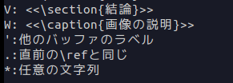
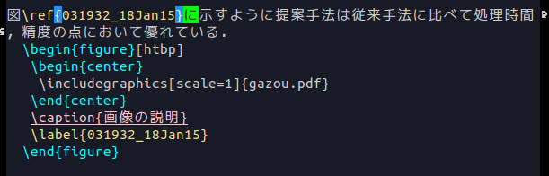
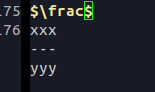

# Yatex commands

## タイプセット（ビルド，コンパイル）

``` bash
Ctrl-c Ctrl-t j
```
## section型補完（sectionとか）

```bash
// [Ctrl]押しながら[c]押して[c]は離して[s]を押す
Ctrl-c Ctrl-s
```

その後，下の方に

```bash
(C-v for view-section) \???{}(default documentclass):
```

と出てくるので入れたいものを入力する．
最初の数文字を入れると[Tab]で補完できる．

### section型補完で入力できる主なもの

|入力したい | 入力するもの | 備考 |
|---|---|---|
| 部 | part | |
| 章 | chapter | |
| 節 | section | 使うのはここから|
| 小節 | subsection | |
| 少々節 | subsection | |
| 図や表の参照番号 | ref | 下の方に詳しい説明|
| 数式の参照番号 | eqref | 同上 |

## begin型補完（数式や画像、表、リストなど）

```bash
// [Ctrl]押しながら[c]押して[c]は離して[b]を押し，全部離して[space]を押す
Ctrl-c Ctrl-b [Space]
```

その後，下の方に

```bash
Begin environment(default xxx):
```

と出てくるので入れたいものを入力する．
最初の数文字を入れると[Tab]キーで補完できる．

### begin型補完で入力できる主なもの

|入力したい | 入力するもの | 備考 |
|---|---|---|
| 画像 | figure | 下のコードをコピペが良い |
| 数式 | eqnarray | 複数行の数式が行けるので実質これ|
| 箇条書き | itemize | 詳しくはググる|
| 表 | | 下のコードをコピる|


画像の挿入用

```tex
\begin{figure}[htbp]
	\begin{center}
		\includegraphics[scale=1]{gazou.pdf}
	\end{center}
	\caption{画像の説明}
\end{figure}
```

表の挿入用

```tex
\begin{table}[bp]
	\caption{表の説明}
	\begin{center}
  		\begin{tabular}{|c|c|c|c|c|c|}
  			\hline
			時間[s] & 入力電圧[V] & 出力角度[deg] & 時間[s] & 入力電圧[V] & 出力角度[deg]\\ 
  			\hline
0.00 & 0.00 & 0.00 & 3.00 & 0.00 & 57.89 \\
0.10 & 1.83 & 9.60 & 3.10 & 0.00 & 57.89 \\
0.20 & 1.45 & 19.56 & 3.20 & 0.00 & 57.89 \\
0.30 & 1.15 & 27.47 & 3.30 & 0.00 & 57.89 \\
2.90 & 0.00 & 57.89 & 5.90 & 0.00 & 57.95 \\
			\hline
 		\end{tabular}
	\end{center}
\end{table}
```

## 参照について
例えば図説明文に図番号を振りたいとき．まず以下のように図番号だけ書かずに文章を書き，画像を挿入するコードをコピペしておく．

```tex
図に示すように提案手法は従来手法に比べて処理時間，精度の点において優れている．
\begin{figure}[htbp]
	\begin{center}
		\includegraphics[scale=1]{gazou.pdf}
	\end{center}
	\caption{画像の説明}
\end{figure}
```

図番号を入れたいところにカーソルを合わせてsection型補完を起動して，`ref`と入力する．

```bash
Ctrl-c Ctrl-s
```

```bash
(C-v for view-section) \???{}(default documentclass): ref[Enter]
```

もし`(default documentclass)`が`(default ref)`になっていればそのまま`[Enter]`を押せばおっけい．

ちなみに数式の参照番号を入れる場合には`eqref`を使うと良い．

下の様にキャプション一覧が出てくるので図番号を参照したいキャプション名の上で[Enter]を押す．



すると下の方に

```bash
Give a label for this line: hogehoge
```

と出てくるので[Enter]を押す．これはTeX上で画像を識別するタグのようなもので1つの画像などにユニークに与えられる必要がある．一度設定すれば二回目に同じ画像を参照しても出てこない．
これで無事に参照番号が振られたと思う．これは画像だけでなく，節や数式にも同じように適用できる．おそらくこの機能が`Yatex`を使う上で一番強いので是非使ってほしい．
なお，上手く参照できれば以下のようになるはずだ．


## 便利機能

### 分数の入力
数式環境中(`$ ~ $`, `eqnarray`環境)で`;`のあとに`f`キーを押すと`\frac`と入力される．



その状態で`[Enter]`キーを押すと分数入力モードになる．下の方に

```bash
Argument 1 of frac:
```

と表示されるので分子を入力して`[Enter]`を入力すると，

```bash
Argument 2 of frac:
```

と表示されるので分母を入力する．`[Enter]`を押すと分数が入力される．

